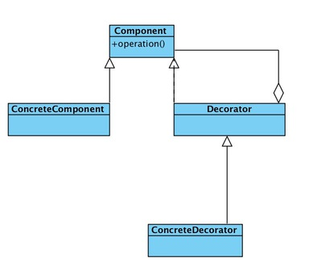

### 装饰模式

定义

    动态的给一个对象添加一些额外的智能，就增加功能来说，装饰模式相比生成子类更加灵活
 
优点

* 装饰类和呗装饰类可以独立发展，而不会相互耦合，换句话说Component类无需知道Decorator类，Decorator类事从外部来扩展Component类功能，而Decorator也不知道具体的构件。
* 装饰模式事集成关系的一个替代方案。我们看装饰类Decorator，不管装饰多少层还是Component，实现的还是is-a的关系
* 装饰模式可以动态的扩展一个实现类的功能，这还不需要多说，装饰模式的定义就是如此。

缺点

* 对于装饰模式记住一点就足够了：多层的装饰事比较复杂的。为什么复杂呢？你想想看，就像剥洋葱似一样，你剥到最后才发现事最里面的装饰出现了问题，想象以下工作量吧，因此，尽量减少装饰类的数量，以便降低系统的复杂度。

使用场景

* 需要扩展一个类的功能，或给一个类增加附加功能。
* 需要动态的给一个对象增加功能，这些功能可以再动态的撤销
* 需要为一批兄弟类进行改装或者加装功能，当然事首选装饰模式
   
类图
    
